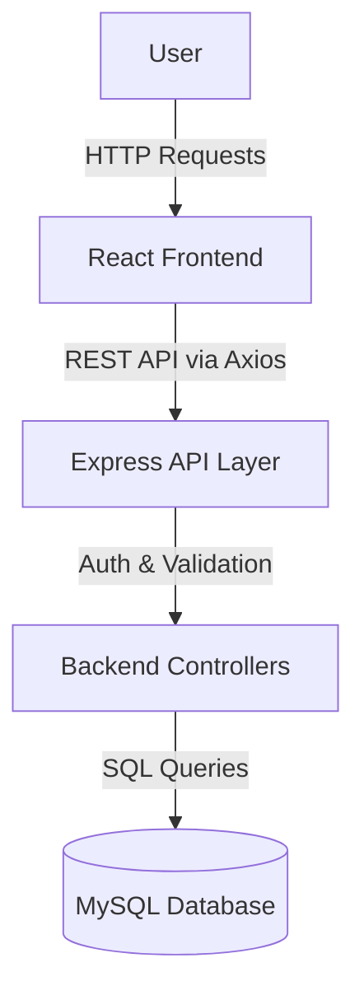
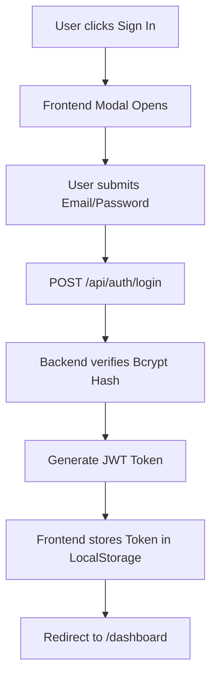
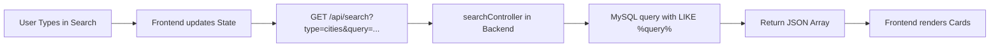
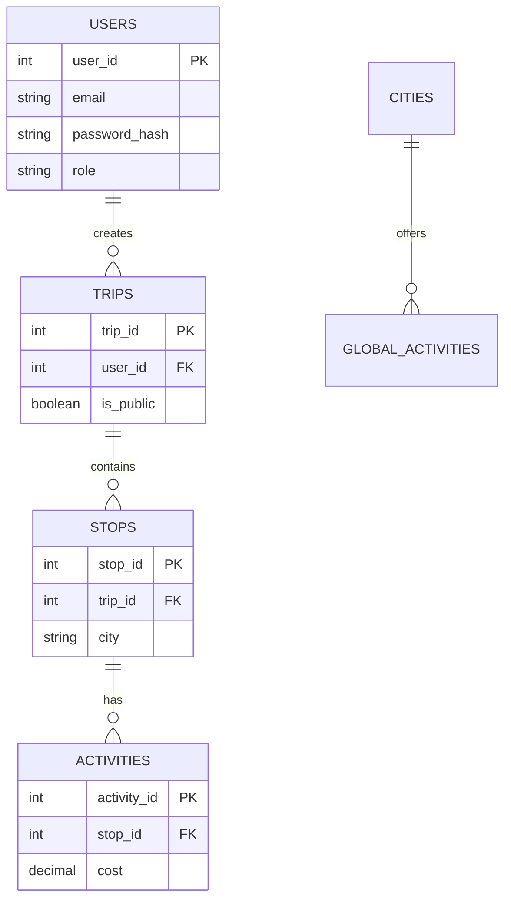

# GlobeTrotter

## 1. Project Overview

**GlobeTrotter** is a personalized, end-to-end travel planning platform that empowers users to dream, design, and organize multi-city trips with ease. 

Traditional travel planning is often scattered across spreadsheets, maps, and separate booking platforms. GlobeTrotter solves this by providing a unified, interactive workspace. Users can explore global destinations, visualize their journeys through structured day-wise itineraries, track real-time budget estimates in INR (₹), and share their final travel plans publicly with a community. It makes travel planning as exciting as the trip itself.

---

## 2. Problem Statement

**The Problem:** Planning multi-city travel is notoriously complex. Travelers struggle to coordinate dates, track rising costs across multiple currencies, research activities, and keep their itineraries organized. Standard tools like Google Sheets or static documents lack geographical context, budget automation, and visual timelines.

**The Solution:** GlobeTrotter replaces fragmented tools with a centralized dashboard. It allows users to search a curated catalog of global destinations, drop them into a timeline, dynamically add activities, and automatically calculate costs. The platform provides a beautiful Calendar view for the traveler and a structured Public view for sharing with friends.

---

## 3. Solution Overview

GlobeTrotter is a full-stack web application consisting of a React-based frontend and an Express/Node.js backend powered by a MySQL database.

- **For standard users**, the platform serves as a personal travel planner. They can create trips, build itineraries using a drag-and-drop style interface, view automated cost breakdowns, and share their itineraries to a public community feed.
- **For administrators**, the platform provides a bird's-eye view of user trends. Admins can view platform statistics (total users, active trips), monitor the most popular destination cities, and manage user accounts (including viewing their trips and deleting malicious accounts).

---

## 4. Key Features

### User Features
- **Secure Authentication:** JWT-based login and registration.
- **Smart Dashboard:** View upcoming trips, recent activity, and quick stats.
- **Trip Management:** Create trips with cover photos, dates, and descriptions.
- **Itinerary Builder:** Add cities (Stops) and assign specific Activities with times and costs (in ₹).
- **Live Budgeting:** Automated pie-chart breakdowns of trip costs categorized by activity type.
- **Calendar View:** A day-wise visual layout of the itinerary.
- **Search Catalog:** Tabbed search to explore popular global destinations and localized activities.
- **Public Sharing:** Toggle trips between Private and Public to share on the Community board.
- **User Profile:** Manage personal information, bio, and language preferences.

### Admin Features
- **Analytics Dashboard:** Visual charts displaying top popular cities and popular activities across the platform.
- **User Management:** Searchable table of all registered users with the ability to delete accounts.
- **Trip Oversight:** Ability to view a specific user's trips via a detailed modal.
- **Global Trip Feed:** Searchable table of all trips created on the platform, regardless of privacy status.

---

## 5. System Architecture



---

## 6. Detailed System Architecture

### Frontend Layer
- **Framework:** React (built with Vite)
- **Routing:** React Router DOM (Client-side routing)
- **Styling:** TailwindCSS for utility-first responsive styling
- **Icons:** Lucide React
- **API Communication:** Axios
- **State Management:** React local state (`useState`, `useEffect`)

### Backend Layer
- **Framework:** Node.js with Express
- **Architecture:** MVC (Model-View-Controller) structure adapted for REST APIs. Routes map to Controllers.
- **Authentication:** `bcryptjs` for password hashing, `jsonwebtoken` for secure stateless sessions.
- **Database Driver:** `mysql2/promise` for asynchronous SQL queries.
- **Middleware:** `authMiddleware` for JWT verification, `adminMiddleware` for role-based access control.

### Database Layer
- **Database:** MySQL relational database.
- **Architecture:** 6 interconnected tables (Users, Trips, Stops, Activities, Cities, GlobalActivities) utilizing robust Foreign Keys with `ON DELETE CASCADE` to maintain referential integrity.

---

## 7. Complete Application Workflow

### User Authentication Workflow


### Main Feature Workflow (Building a Trip)
1. User clicks "Create Trip" on Dashboard.
2. User provides Name, Dates, and Cover Photo URL.
3. User is redirected to **Itinerary Builder**.
4. User clicks "Add Stop" (creates a record in `Stops` table).
5. User adds an Activity to the Stop (creates a record in `Activities` table).
6. Frontend calculates total budget dynamically.
7. User clicks "Save Itinerary" -> navigates to **Itinerary View**.

---

## 8. Data Flow

### Example: Searching for a Destination



---

## 9. Database Architecture



---

## 10. Database Table Documentation

### `Users`
| Field | Type | Description | Constraints |
| ----- | ---- | ----------- | ----------- |
| user_id | INT | Unique identifier | Primary Key, Auto Increment |
| name | VARCHAR | User's full name | NOT NULL |
| email | VARCHAR | Login email | NOT NULL, UNIQUE |
| password_hash | VARCHAR | Bcrypt encrypted password | NOT NULL |
| role | VARCHAR | 'user' or 'admin' | Default 'user' |

### `Trips`
| Field | Type | Description | Constraints |
| ----- | ---- | ----------- | ----------- |
| trip_id | INT | Unique identifier | Primary Key |
| user_id | INT | Author of the trip | FK -> Users(user_id) ON DELETE CASCADE |
| is_public | BOOLEAN | Community visibility | Default FALSE |

### `Stops`
| Field | Type | Description | Constraints |
| ----- | ---- | ----------- | ----------- |
| stop_id | INT | Unique identifier | Primary Key |
| trip_id | INT | Parent trip | FK -> Trips(trip_id) ON DELETE CASCADE |
| city | VARCHAR | Destination name | NOT NULL |

### `Activities`
| Field | Type | Description | Constraints |
| ----- | ---- | ----------- | ----------- |
| activity_id | INT | Unique identifier | Primary Key |
| stop_id | INT | Parent stop/city | FK -> Stops(stop_id) ON DELETE CASCADE |
| cost | DECIMAL | Cost in INR (₹) | Default 0.00 |
| category | VARCHAR | Food, Sightseeing, etc. | |

---

## 11. Tech Stack

| Layer | Technology | Purpose |
| --- | --- | --- |
| Frontend | React (Vite) | UI Framework |
| Styling | TailwindCSS | Utility-first CSS framework |
| Icons | Lucide React | SVG Icon library |
| Animations | Framer Motion | UI Transitions |
| Backend | Node.js / Express | REST API Server |
| Database | MySQL | Relational Data Storage |
| Authentication | JWT & Bcrypt | Security and Sessions |

---

## 12. Project File Structure

```text
GlobeTrotter/
├── frontend/
│   ├── src/
│   │   ├── components/      # Reusable UI (AuthModal, Navbar, ProtectedRoute)
│   │   ├── pages/           # Page-level components (Dashboard, SearchPage, etc.)
│   │   │   └── admin/       # Admin-specific pages
│   │   ├── App.jsx          # Frontend entry and router setup
│   │   └── index.css        # Tailwind directives
│   └── vite.config.js       # Vite configuration
│
├── backend/
│   ├── config/
│   │   └── db.js            # MySQL connection pool setup
│   ├── controllers/         # Business logic (authController, tripController)
│   ├── middleware/          # JWT and Admin verification (authMiddleware.js)
│   ├── init.js              # Database initialization and table creation
│   ├── bulkSeed.js          # Massive dummy data generator
│   ├── server.js            # Express server entry point and route definitions
│   └── .env                 # Environment variables
│
└── README.md
```

---

## 13. Frontend Architecture

The frontend is a React Single Page Application (SPA). 
- **Routes:** Managed by `react-router-dom` in `App.jsx`.
- **Protection:** The `ProtectedRoute` component wraps private routes. It checks `localStorage` for a JWT token. If missing, it redirects to the Landing Page. Admin routes verify the `role` stored in `localStorage`.
- **State Management:** Handled locally within pages using `useState`. Cross-component state (like Authentication status and Dark Mode) is lifted to `App.jsx` and passed down as props.
- **API Integration:** Axios is used directly in `useEffect` blocks to fetch data on component mount.

---

## 14. Backend Architecture

The backend is an Express REST API.
- **Entry Point:** `server.js` initializes Express, sets up CORS, and defines all API routes.
- **Controllers:** Controllers (e.g. `tripController.js`) handle the request/response cycle. They extract data from `req.body` or `req.params`, execute raw SQL queries via `db.js`, and return JSON responses.
- **Middleware:** `authMiddleware.js` intercepts requests, reads the `Bearer` token from the `Authorization` header, verifies it with `jwt.verify`, and attaches the decoded `user_id` to the request object.

---

## 15. API Documentation

### Authentication
- `POST /api/auth/signup`: Creates a new user. Returns JWT.
- `POST /api/auth/login`: Verifies credentials. Returns JWT and user role.

### Trips
- `GET /api/trips`: Fetches all private trips for the authenticated user.
- `POST /api/trips`: Creates a new trip.
- `GET /api/trips/:id`: Fetches full nested trip details (Stops & Activities).
- `PUT /api/trips/:id/public`: Toggles a trip's community visibility.

### Admin
- `GET /api/admin/stats`: Returns platform-wide aggregates (total users, active trips).
- `GET /api/admin/users`: Returns all users.
- `DELETE /api/admin/users/:id`: Deletes a user and cascades deletions to their trips.
- `GET /api/admin/users/:id/trips`: Fetches all trips belonging to a specific user.

---

## 16. Authentication & Authorization

- **Login:** Users submit email/password. The backend finds the user, uses `bcrypt.compare` to verify the password, and generates a JWT signed with `JWT_SECRET`.
- **Session:** The frontend stores the JWT in `localStorage` and attaches it to the `Authorization: Bearer <token>` header for all subsequent API requests.
- **Role-Based Authorization:** Admin routes require passing through two middleware functions: `authMiddleware` (verifies the token is valid) AND `adminMiddleware` (queries the database to ensure the token's `user_id` belongs to an account with `role = 'admin'`).

---

## 17. User Roles & Permissions

| Feature | User | Admin |
| --- | --- | --- |
| Create/Edit Trips | ✓ | ✓ |
| View Public Community Trips | ✓ | ✓ |
| View Admin Dashboard | ✗ | ✓ |
| View All Platform Trips | ✗ | ✓ |
| Delete Other Users | ✗ | ✓ |

---

## 18. Screen / Page Documentation

- **Landing Page (`LandingPage.jsx`):** Marketing page with Hero section, feature list, and Auth modals.
- **Dashboard (`Dashboard.jsx`):** Overview of the user's upcoming trips and a quick-start "Create Trip" button.
- **Itinerary Builder (`ItineraryBuilder.jsx`):** Complex form allowing users to dynamically add multiple Stops and Activities to a trip.
- **Itinerary View (`ItineraryView.jsx`):** Read-only, printable view of the trip. Allows toggling visibility to Public.
- **Budget View (`BudgetView.jsx`):** Parses all activity costs within a trip and generates total estimates and category breakdowns.
- **Search Page (`SearchPage.jsx`):** Tabbed interface to browse Cities or specific Global Activities.
- **Admin Dashboard (`AdminDashboard.jsx`):** High-level charts showing popular destinations and platform usage.
- **Manage Users (`ManageUsers.jsx`):** Admin table to view, inspect (View Trips modal), or ban users.

---

## 19. Feature-Level Technical Explanation: Itinerary Builder

**What it does:** Allows users to plan a complex multi-city trip.
**Frontend Implementation:** Uses a complex nested state array: `[{ city: '', activities: [{ name: '', cost: 0 }] }]`. Users can dynamically append to these arrays.
**API Used:** `PUT /api/trips/:id/itinerary`
**Backend Implementation:** The backend receives the entire nested JSON payload. Because SQL isn't document-based, the controller first deletes all existing Stops and Activities for the trip to prevent duplicates. It then loops through the payload, inserting new Stops, grabbing their `insertId`, and subsequently inserting the associated Activities.
**Database Interaction:** Raw `INSERT` queries executed sequentially inside a loop.

---

## 20. Validation & Error Handling

- **Frontend:** HTML5 form validation (required attributes). Axios `catch` blocks intercept HTTP errors and display `alert()` popups to the user.
- **Backend:** Basic request body presence checks. If a database query fails (e.g. Unique Constraint violation on Email), the catch block intercepts it and returns a `500` status with a generic JSON error message to prevent leaking SQL syntax to the client.

---

## 21. Search, Filtering, Sorting & Pagination

- **Global Search:** Handled Server-Side. The frontend passes a `query` parameter. The backend executes a `SELECT * FROM Cities WHERE name LIKE ?` query.
- **Admin Tables:** Handled Client-Side. The `ManageUsers.jsx` and `AllTrips.jsx` components fetch the entire dataset and use Javascript `.filter()` based on a local React search state.

*(Note: Pagination is currently not implemented due to small dataset assumptions).*

---

## 22. Security

- **Password Hashing:** Passwords are never stored in plaintext. They are hashed using `bcryptjs` with a salt round of 10.
- **SQL Injection:** All backend queries use Parameterized Queries (`?` placeholders via `mysql2`) to prevent SQL injection attacks.
- **JWT Protection:** APIs reject any request lacking a valid JWT signature.
- **Environment Secrets:** Database credentials and JWT secrets are loaded via `.env` files and excluded from version control via `.gitignore`.

---

## 23. Installation & Setup

### Prerequisites
- Node.js (v18+)
- MySQL Server running locally

### Database Setup
1. Create a `.env` file in the `backend/` directory:
```env
DB_HOST=localhost
DB_USER=root
DB_PASSWORD=your_mysql_password
JWT_SECRET=super_secret_jwt_key_for_globe_trotter
PORT=5000
```
2. Run the bulk seeder script to initialize the database and tables:
```bash
cd backend
npm install
node bulkSeed.js
```

### Run the Application
You need two terminal windows.

**Terminal 1 (Backend):**
```bash
cd backend
npm start
```

**Terminal 2 (Frontend):**
```bash
cd frontend
npm install
npm run dev
```

---

## 24. Environment Variables

| Variable | Purpose | Required |
| --- | --- | --- |
| `DB_HOST` | MySQL Server Hostname | Yes |
| `DB_USER` | MySQL Username | Yes |
| `DB_PASSWORD` | MySQL Password | Yes |
| `JWT_SECRET` | Key used to sign Auth Tokens | Yes |
| `PORT` | Express server port (Default: 5000) | No |

---

## 25. Known Limitations

- **No Pagination:** Admin tables and community feeds load all records into memory at once.
- **Images:** Cover photos currently rely on external URL strings rather than handling physical file uploads to AWS S3 / Cloudinary.
- **Testing:** There are currently no automated unit or integration tests (Jest/Cypress) implemented.
- **Deployment:** The application is currently configured strictly for local development (hardcoded `localhost:5000` API URLs).

---

## 26. Future Improvements

- Extract hardcoded `localhost:5000` URLs in the frontend to a dynamic Axios instance utilizing `VITE_API_BASE_URL`.
- Implement Pagination or Infinite Scrolling on the Community and Admin pages.
- Add real-time notifications when a user likes or comments on a public trip (would require WebSockets/Socket.io).
- Implement a physical file upload system for trip cover photos.
- Implement comprehensive automated testing.
